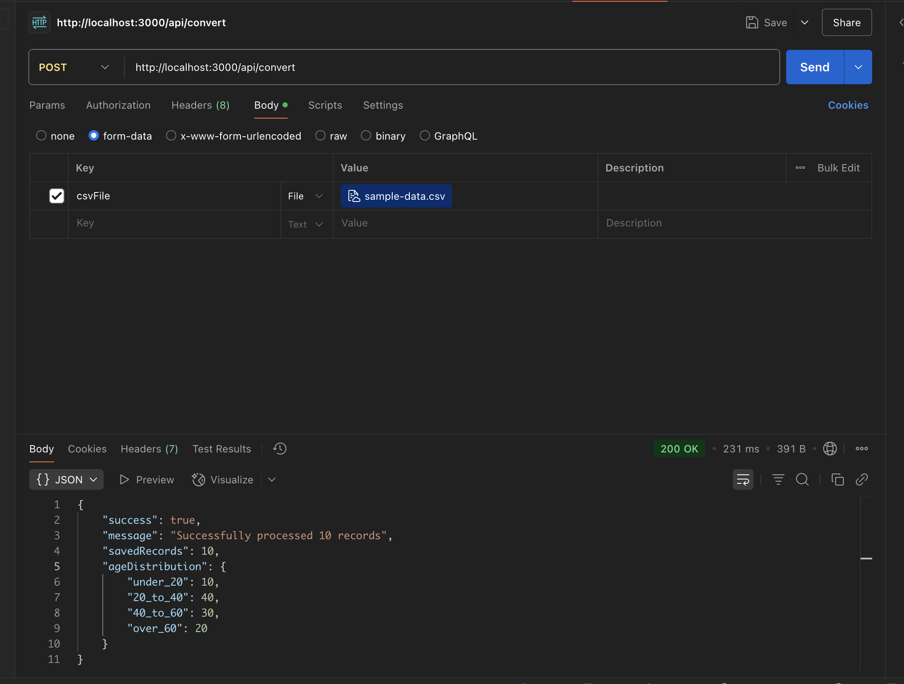

# CSV to JSON Converter API

A Node.js application that converts CSV files to JSON and stores the data in a PostgreSQL database.

## Features

- Custom CSV to JSON conversion without using external packages
- Support for nested properties with dot notation (e.g., name.firstName)
- Upload and process CSV files with potentially 50,000+ records
- Store data in PostgreSQL with the specified schema
- Calculate and display age distribution statistics

## Getting Started

### Prerequisites

- Node.js (14.x or higher)
- PostgreSQL (13.x or higher)

### Installation

1. Clone the repository
2. Install dependencies:
   ```
   npm install
   ```
3. Copy the example environment file and update with your details:
   ```
   cp .env.example .env
   ```
4. Create the PostgreSQL database and update the connection details in the `.env` file

### Running the Application

Start the development server:

```
npm run dev
```

Or for production:

```
npm start
```

## API Endpoints

### POST /api/convert

Upload and process a CSV file.

**Request:**

- Method: POST
- Content-Type: multipart/form-data
- Body: Form data with a field named 'csvFile' containing the CSV file

**Response:**

```json
{
  "success": true,
  "message": "Successfully processed 10 records",
  "savedRecords": 10,
  "ageDistribution": {
    "under_20": 10,
    "20_to_40": 40,
    "40_to_60": 30,
    "over_60": 20
  }
}
```

### GET /api/health

Health check endpoint.

**Response:**

```json
{
  "status": "ok"
}
```

## Testing

Run the test suite:

```
npm test
```

## Sample Data

A sample CSV file is included at `sample-data.csv` for testing the application.

## Configuration

The application can be configured using environment variables:

- `PORT`: Server port (default: 3000)
- `DB_HOST`: PostgreSQL host (default: localhost)
- `DB_PORT`: PostgreSQL port (default: 5432)
- `DB_USER`: PostgreSQL username (default: postgres)
- `DB_PASSWORD`: PostgreSQL password (default: postgres)
- `DB_NAME`: PostgreSQL database name (default: postgres)
- `UPLOAD_DIR`: Directory for uploaded files (default: uploads)

Sample Response

